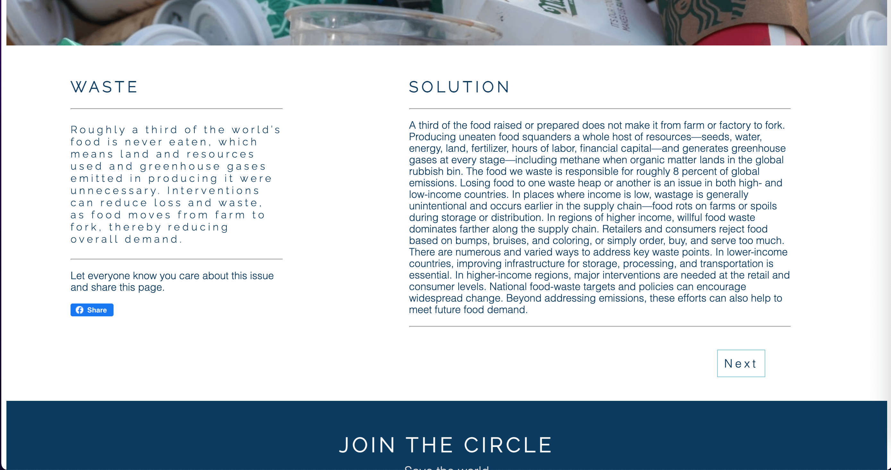
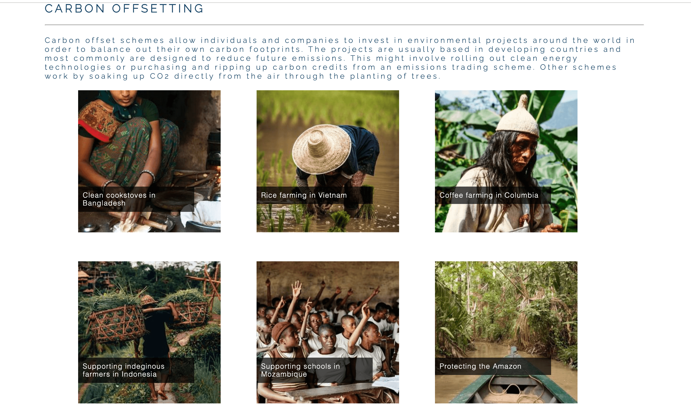

# The Circle

Our mission is to create a global wellness community around the ideas and practices of sustainability, simplicity and resilience.

We call it sustainable life strategies and you can think of it as a cross between Greta Thunberg and Tony Robbins.

The Circle aims to inform, educate and challenge the way we think about sustainability and climate change.

It is a first of it's kind personal development agency tha aims to not only bring the earth back to life, but also bring ourselves back to life, bringing our essence, our spirit, our sense of purpose back to life. It’s about bringing meaning to our lives while saving our planet.

The website begins with educating users about sustainability, as you progress through the site you learn more including reasons to be hopefull. This is meant to inspire people into action before moving onto things people can actually do in there own lives, finally the site tells users about the coaching services offered from The Circle.

## Features 

This website is for anybody who wants to learn more about sustainability and take action to making our planet more sustainable.

### Existing Features

- __Navigation Bar__

  - Featured on all twelve pages, the full responsive navigation bar includes links to the Home, Footprint, Hope, Lifestyle, Coaching and Join Us pages are identical in each page to allow for easy navigation.
  - This section will allow the user to easily navigate from page to page across all devices without having to revert back to the previous page via the ‘back’ button.
  - This section allows users to easily see what page they are on, as the current page is highlighted. highlighted 
  - When on one of the 6 awareness pages no page will be highlighted.

- __The Footer__

  - Featured on all twelve pages, so users have a constant call to action to register their email address.
  - The footer section includes a field for users to submit their email.
  - The footer is valuable to the user as they will be able to register for our weekly newsletter on how to be more sustainable.
  - The email address has to entered before the user can click join.

- __The landing page image__

  - The landing page includes a photograph with text overlay to allow the user to see exactly what The Circle is about. The world's first sustainability life startegy agency.

- __Introduction Section__
  - The introduction section lets user know what The Circle does and what our mission is.

- __Awareness Section__

  - The awareness section exists to draw the users attention to issues surrounding sustainability
  - We have picked 6 issues that the user may or may not be aware of. If the user wants to find out more information they are easily able to navigated to a dedicated page with more information on that issue. 

- __The Team__

  - The Team sections gives users some background about the team behind the circle.
  - This is important for the user to see The Circle is a credible organisation.

- __Awareness Section Individual Pages__

 - The awareness section individual pages all have the same structure, consisting of a relevant hero image, 2 columns, the left hand column is the overview the right hand column is the solutions
 - There is a button so users can easily share to facebook.
 - The user can easily navigate to the next page by clicking next, this saves time having to go back to the home page. 

- __Rewilding__

  - Nature has the power to heal itself and to heal us, if we let it. That’s what rewilding is all about.

  

- __Education of Girls__

  - Women with more years of education have fewer and healthier children, and actively manage their reproductive health.

  

- __Waste__

  - Roughly a third of the world’s food is never eaten, which means greenhouse gases emitted in producing it were unnecessary.

  

- __Building Management__

  - Fluorinated gases have a potent greenhouse effect and are widely used as refrigerants. Managing leaks and disposal of these chemicals can avoid emissions in buildings and landfills.

  

- __Climate Justice__

  - Not all climate impacts are created equal, or distributed equally. From extreme weather to rising sea levels, the effects of climate change often have disproportionate effects on historically marginalized communities.

- __Renewable Energy__

  - Already, economics favor wind and sun over fossil fuels in many places. A shift away from coal-powered electricity is underway in the United States, the United Kingdom, and much of Europe.

- __Footprint__

  - 

  - 

  - 

- __Hope__

- __Lifestyle__

- __Coaching__

  - 

  - 

  - 

- __Join Us__

 - 

### Features Left to Implement

- __Footprint Calculator__

 - We are going to create a carbon footprint calculator, users can inpuyt their activity and we will calculate their impact on the environment.  

- __Recipies__

 - To help users improve their diets we will be creating recipe pages for plant based, healthy and delicious food.

## Testing 

- __Different Browsers__

 - The site tests well on different browsers, I noticed one difference on Mozilla, see below.

- __Chrome__

 - All previous screenshots in this document have been taken from Chrome.

- __Mozilla__

 - Carousel works perfectly but looks different in Mozilla, it is alingned to the left rather than center as it is in other browsers.

 - 

- __Edge__

- __Footer__

 - You are not able to click join unless you enter your email address.

 - 

### Validator Testing 

- __Html__

  - No errors were returned when passing through the official [W3C validator](https://responsibleuk.github.io/the-circle/index.html)

- __The landing page image__

 -  

- __Rewilding__

 - 

- __Education of Girls__

 - 

- __Waste__

- __Building Management__

- __Climate Justice__

- __Renewable Energy__

- 

- __Footprint__

- 

- __Hope__

- 

- __Lifestyle__

- 

- __Coaching__

- __Join Us__

- 

- __CSS__

  - 3 errors were found when passing through the official [(Jigsaw) validator](https://jigsaw.w3.org/css-validator/validator?uri=https%3A%2F%2Fvalidator.w3.org%2Fnu%2F%3Fdoc%3Dhttps%253A%252F%252Fcode-institute-org.github.io%252Flove-running-2.0%252Findex.html&profile=css3svg&usermedium=all&warning=1&vextwarning=&lang=en#css)

 - 

### Unfixed Bugs

No bugs unfixed

## Deployment

The site was deployed to GitHub pages. The steps to deploy are as follows: 
  - In the [GitHub repository](https://github.com/Responsibleuk/the-circle), navigate to the Settings tab 
  - From the source section drop-down menu, select the **Main** Branch, then click "Save".
  - The page will be automatically refreshed with a detailed ribbon display to indicate the successful deployment.

The live link can be found [here](https://responsibleuk.github.io/the-circle)

## Local Deployment

In order to make a local copy of this project, you can clone it. In your IDE Terminal, type the following command to clone my repository:

- `git clone https://github.com/Responsibleuk/the-circle.git`

Alternatively, if using Gitpod, you can click below to create your own workspace using this repository.

### Content 

- The text for the Home page was taken from Wikipedia Article A
- Instructions on how to implement form validation on the Sign Up page was taken from [Specific YouTube Tutorial](https://www.youtube.com/)
- The icons in the footer were taken from [Font Awesome](https://fontawesome.com/)

The content has been inspired by:
https://drawdown.org/
https://www.tonyrobbins.com/
https://www.onecommune.com/login
https://sdgs.un.org/goals
https://news.sky.com/story/climate-change-seven-technology-solutions-that-could-help-solve-crisis-12056397
https://www.onecommune.com/regeneration-with-paul-hawken-teacher-wisdom
https://www.climategen.org/who-we-are/our-mission-and-vision/

- Hope source
https://news.sky.com/story/climate-change-seven-technology-solutions-that-could-help-solve-crisis-12056397

 - Methodology source
https://freefrontend.com/css-carousels/#horizontal-carousels
https://codepen.io/onion2k/pen/xxZYBVj

### Media

- The photos used on the site are from This Open Source site

https://unsplash.com/

- The images used for the UN SDG's are used from this Open Source site 

https://sdgs.un.org/goals

### Code

 - Favicon icon code https://www.codegrepper.com/code-examples/html/%3Clink+rel%3D%22icon%22+type%3D%22image%2Fpng%22+href%3D%22assets%2Fimg%2Ffavicon.png%22%3E

 - Navigation responsive
https://codepen.io/victorcopque/pen/OVxRbq

 - Offsetting styling
http://bluegalaxy.info/codewalk/2018/04/05/html-css-expand-text-hover/

https://www.wren.co/offset-anything

 - Lifestyle page layout
https://tympanus.net/codrops/2012/06/12/css-only-responsive-layout-with-smooth-transitions/

 - Carousel
https://codepen.io/onion2k/pen/xxZYBVj

 - General
https://publishing-project.rivendellweb.net/using-figures-and-flex-box-to-align-captions/

